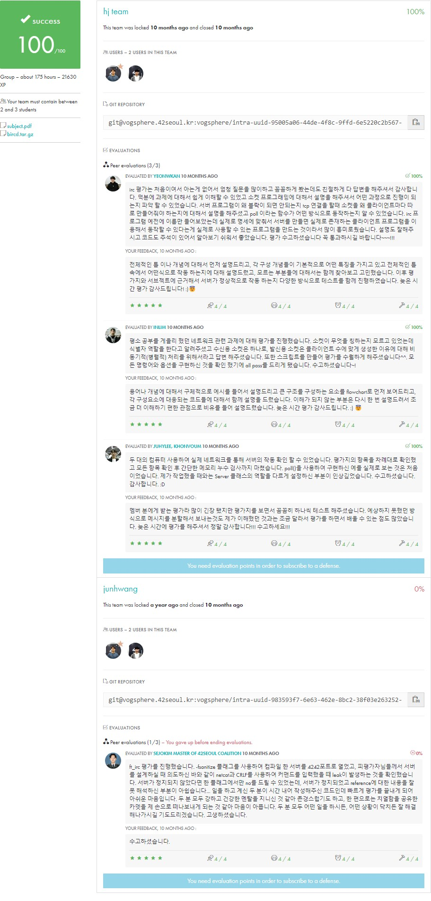
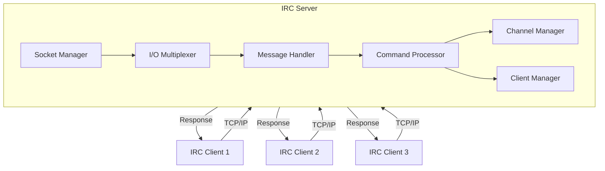
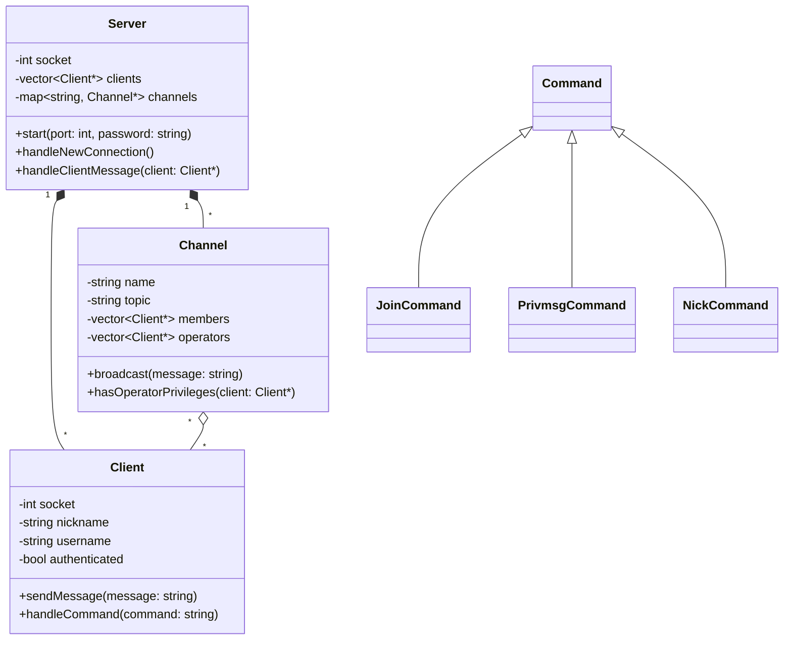
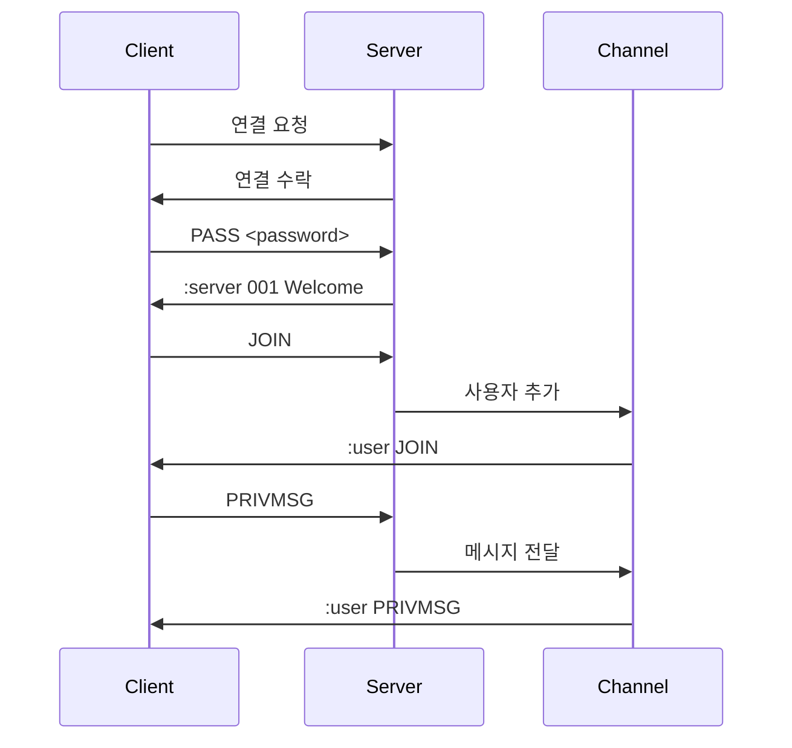

<div align="center">
  <h1>💬 ft_irc</h1>
  <p>Internet Relay Chat Server | C++ | Network Programming</p>

  
  
  <div>
    
    
    
    
  </div>

  ### 주요 기능
  - IRC 프로토콜 구현
  - 멀티플렉싱을 통한 다중 클라이언트 처리
  - 채널 관리 및 사용자 권한
  - 비밀번호 인증

  ### 사용 기술
  - C++ 소켓 프로그래밍
  - select/poll/epoll 멀티플렉싱
  - IRC 프로토콜 (RFC 1459)
  - TCP/IP 네트워킹
</div>

## 🚀 Quick Start
```bash
# 1. 저장소 클론
git clone https://github.com/username/ft_irc.git && cd ft_irc

# 2. 빌드
make

# 3. 서버 실행
./ircserv 6667 password

# 4. IRC 클라이언트로 접속
## irssi 사용
irssi
/connect localhost 6667
/pass password
/nick yournick
/user username 0 * :realname

## 또는 netcat으로 테스트
nc localhost 6667
PASS password
NICK testuser
USER testuser 0 * :Test User
```

## 📋 목차
1. [개요](#-개요)
2. [IRC 명령어](#-irc-명령어)
3. [IRC 프로토콜](#-irc-프로토콜)
4. [아키텍처](#-아키텍처)
5. [구현 사항](#-구현-사항)
6. [설치 및 실행](#-설치-및-실행)
7. [테스트](#-테스트)
8. [문제 해결](#-문제-해결)

## 🎯 개요
> IRC(Internet Relay Chat) 서버를 C++로 구현하는 프로젝트입니다.

### 구현해야 할 기능
1. **사용자 인증**
   - 비밀번호 검증
   - 닉네임 중복 확인
   - 사용자 등록 처리

2. **채널 관리**
   - 채널 생성/삭제
   - 사용자 참여/퇴장
   - 채널 모드 관리
   - 운영자 권한 관리

3. **메시지 처리**
   - 채널 메시지 브로드캐스트
   - 개인 메시지 전달
   - 알림 메시지 처리

4. **에러 처리**
   - 잘못된 명령어 처리
   - 권한 부족 처리
   - 존재하지 않는 대상 처리
   - 중복 닉네임 처리

### 소켓 프로그래밍 기초
1. **소켓(Socket)**
   - 네트워크 통신의 엔드포인트
   - 파일 디스크립터로 관리됨
   - TCP/IP 프로토콜 사용

2. **서버 소켓 동작**
   ```
   socket() → bind() → listen() → accept() → read()/write()
   ```

3. **클라이언트 소켓 동작**
   ```
   socket() → connect() → read()/write()
   ```

4. **멀티플렉싱**
   - select/poll/epoll을 사용한 다중 클라이언트 처리
   - Non-blocking I/O로 효율적인 리소스 관리
   - 이벤트 기반 프로그래밍

### 소켓 생성과 바인딩
```cpp
int socket(int domain, int type, int protocol);
// domain: AF_INET (IPv4)
// type: SOCK_STREAM (TCP)
// protocol: 0 (기본 프로토콜)

int bind(int sockfd, const struct sockaddr *addr, socklen_t addrlen);
// sockfd: 소켓 디스크립터
// addr: 주소 정보
// addrlen: 주소 구조체 크기
  
int listen(int sockfd, int backlog);
// backlog: 연결 대기 큐의 최대 길이

int accept(int sockfd, struct sockaddr *addr, socklen_t *addrlen);
// 새로운 클라이언트 연결 수락
```

### 블로킹/논블로킹 I/O
- 블로킹: 작업이 완료될 때까지 대기
- 논블로킹: 즉시 반환, EAGAIN/EWOULDBLOCK 에러 처리

### select/poll/epoll
- select: fd_set 사용, 제한된 파일 디스크립터 수
- poll: pollfd 구조체 사용, 더 많은 디스크립터 처리 가능
- epoll: 리눅스 전용, 높은 성능의 이벤트 통지 메커니즘

### 프로젝트 구조
```
📦 ft_irc
 ├── 📜 Makefile
 ├── 📂 includes/
 │   ├── 📜 Server.hpp      # 서버
 │   ├── 📜 Client.hpp      # 클라이언트
 │   ├── 📜 Channel.hpp     # 채널
 │   ├── 📜 Command.hpp     # 명령어
 │   └── 📜 Utils.hpp       # 유틸리티
 ├── 📂 srcs/
 │   ├── 📜 main.cpp        # 메인 함수
 │   ├── 📜 Server.cpp      # 서버
 │   ├── 📜 Client.cpp      # 클라이언트
 │   ├── 📜 Channel.cpp     # 채널
 │   ├── 📜 Command.cpp     # 명령어
 │   └── 📂 commands/
 │       ├── 📜 join.cpp    # JOIN
 │       ├── 📜 privmsg.cpp # PRIVMSG
 │       ├── 📜 nick.cpp    # NICK
 │       ├── 📜 user.cpp    # USER
 │       ├── 📜 pass.cpp    # PASS
 │       ├── 📜 quit.cpp    # QUIT
 │       ├── 📜 part.cpp    # PART
 │       ├── 📜 topic.cpp   # TOPIC
 │       ├── 📜 mode.cpp    # MODE
 │       ├── 📜 kick.cpp    # KICK
 │       ├── 📜 invite.cpp  # INVITE
 │       ├── 📜 notice.cpp  # NOTICE
 │       └── 📜 ping.cpp    # PING  
```

### 주요 클래스
```cpp
class Server {
private:
    int _socket;
    std::vector<Client*> _clients;
    std::map<std::string, Channel*> _channels;
    
public:
    void start(int port, const std::string& password);
    void handleNewConnection();
    void handleClientMessage(Client* client);
};

class Client {
private:
    int _socket;
    std::string _nickname;
    std::string _username;
    bool _authenticated;
    
public:
    void sendMessage(const std::string& message);
    void handleCommand(const std::string& command);
};

class Channel {
private:
    std::string _name;
    std::string _topic;
    std::vector<Client*> _members;
    std::vector<Client*> _operators;
    
public:
    void broadcast(const std::string& message, Client* sender = nullptr);
    bool hasOperatorPrivileges(Client* client);
};
```

### Key Features
- Non-blocking I/O 처리
- 채널 생성 및 관리
- 사용자 인증 및 권한 관리
- IRC 명령어 구현
- 에러 처리 및 예외 상황 대응

## 💻 IRC 명령어
> ft_irc 서버에서 구현된 IRC 명령어와 사용 예시입니다.

### 1. 필수 구현 명령어
```bash
# 1. 연결 및 등록 (순서 중요)
PASS <password>             # 서버 비밀번호 검증 (가장 먼저 실행)
NICK <nickname>             # 닉네임 설정 (최대 9자, 중복 불가)
USER <username> 0 * :name   # 사용자 등록 (PASS, NICK 이후 실행)

# 2. 채널 관련
JOIN #<channel> [key]       # 채널 참여/생성 (key: 비밀번호 설정된 경우)
PART #<channel>            # 채널 나가기
TOPIC #<channel> [:topic]  # 채널 주제 확인/설정 (+t 모드시 운영자만)

# 3. 메시지
PRIVMSG <target> :<text>   # 메시지 전송 (target: 채널/사용자)
NOTICE <target> :<text>    # 알림 전송 (PRIVMSG와 유사, 자동응답 없음)

# 4. 채널 관리
MODE #<channel> <+/-><modes> [params]  # 채널 모드 설정
KICK #<channel> <nickname> [:reason]   # 사용자 강제 퇴장
INVITE <nickname> #<channel>           # 사용자 초대
```

### 2. 채널 모드
```bash
# 채널 모드 설정 (/mode #channel <+/-><mode>)
+i  # invite-only: 초대된 사용자만 참여 가능
+t  # topic: 운영자만 주제 변경 가능
+k  # key: 채널 비밀번호 설정
+o  # operator: 채널 운영자 권한 부여/제거
+l  # limit: 채널 인원 제한
```

### 3. 사용 예시
```bash
# 1. 서버 접속 및 인증
PASS secretpassword
NICK mynick
USER myuser 0 * :Real Name

# 2. 채널 생성 및 참여
JOIN #mychannel
MODE #mychannel +t
TOPIC #mychannel :Welcome to my channel!

# 3. 메시지 전송
PRIVMSG #mychannel :Hello everyone!
PRIVMSG othernick :Private message

# 4. 채널 관리
MODE #mychannel +o othernick
KICK #mychannel baduser
INVITE friend #mychannel
```

### 4. 응답 코드
```bash
# 1. 연결 관련 응답 (0xx)
001 RPL_WELCOME           # "Welcome to the Internet Relay Network <nick>!<user>@<host>"
002 RPL_YOURHOST         # "Your host is <servername>, running version <ver>"
003 RPL_CREATED          # "This server was created <date>"
004 RPL_MYINFO          # "<servername> <version> <available user modes> <available channel modes>"

# 2. 성공 응답 (2xx)
200 RPL_NONE               # 응답 없음
201 RPL_UMODEIS           # <user_modes> [<user_params>]

# 3. 명령어 응답 (3xx)
301 RPL_AWAY              # <nick> :<away_message>
311 RPL_WHOISUSER         # <nick> <user> <host> * :<real_name>
321 RPL_LISTSTART         # Channel :Users Name
322 RPL_LIST              # <channel> <# visible> :<topic>
331 RPL_NOTOPIC           # <channel> :No topic is set
332 RPL_TOPIC             # <channel> :<topic>
341 RPL_INVITING          # <channel> <nick>
353 RPL_NAMREPLY          # <channel> :[[@|+]<nick> [[@|+]<nick> [...]]]
366 RPL_ENDOFNAMES        # <channel> :End of /NAMES list

# 4. 에러 응답 (4xx)
401 ERR_NOSUCHNICK        # <nickname> :No such nick/channel
403 ERR_NOSUCHCHANNEL     # <channel> :No such channel
404 ERR_CANNOTSENDTOCHAN  # <channel> :Cannot send to channel
411 ERR_NORECIPIENT       # :No recipient given (<command>)
412 ERR_NOTEXTTOSEND      # :No text to send
421 ERR_UNKNOWNCOMMAND    # <command> :Unknown command
431 ERR_NONICKNAMEGIVEN   # :No nickname given
432 ERR_ERRONEUSNICKNAME  # <nick> :Erroneous nickname
433 ERR_NICKNAMEINUSE     # <nick> :Nickname is already in use
441 ERR_USERNOTINCHANNEL  # <nick> <channel> :They aren't on that channel
442 ERR_NOTONCHANNEL      # <channel> :You're not on that channel
461 ERR_NEEDMOREPARAMS    # <command> :Not enough parameters
464 ERR_PASSWDMISMATCH    # :Password incorrect
471 ERR_CHANNELISFULL     # <channel> :Cannot join channel (+l)
473 ERR_INVITEONLYCHAN    # <channel> :Cannot join channel (+i)
474 ERR_BANNEDFROMCHAN    # <channel> :Cannot join channel (+b)
475 ERR_BADCHANNELKEY     # <channel> :Cannot join channel (+k)
482 ERR_CHANOPRIVSNEEDED  # <channel> :You're not channel operator
```

## 📡 IRC 프로토콜
> RFC 1459 표준에 따른 IRC 프로토콜 구현 내용을 설명합니다.

### 1. 기본 명령어
```cpp
// Command.hpp
class Command {
public:
    // 연결 및 등록
    void PASS(Client* client, const std::vector<std::string>& params);  // 비밀번호 인증
    void NICK(Client* client, const std::vector<std::string>& params);  // 닉네임 설정
    void USER(Client* client, const std::vector<std::string>& params);  // 사용자 등록
    
    // 채널 관련
    void JOIN(Client* client, const std::vector<std::string>& params);  // 채널 참여
    void PART(Client* client, const std::vector<std::string>& params);  // 채널 퇴장
    void TOPIC(Client* client, const std::vector<std::string>& params); // 채널 주제 설정
    void NAMES(Client* client, const std::vector<std::string>& params); // 채널 사용자 목록
    
    // 메시지 전송
    void PRIVMSG(Client* client, const std::vector<std::string>& params); // 개인/채널 메시지
    void NOTICE(Client* client, const std::vector<std::string>& params);  // 알림 메시지
};
```

### 2. 메시지 형식
```cpp
// Message.hpp
struct Message {
    std::string prefix;     // 발신자 정보 (선택)
    std::string command;    // 명령어
    std::vector<std::string> params;  // 매개변수
    
    // IRC 메시지 파싱
    static Message parse(const std::string& raw) {
        Message msg;
        // [:prefix] COMMAND param1 param2 ... :trailing
        // 예: :nick!user@host PRIVMSG #channel :Hello, World!
        return msg;
    }
    
    // IRC 메시지 직렬화
    std::string serialize() const {
        std::string result;
        // 메시지 형식에 맞게 조합
        return result;
    }
};
```

### 3. 응답 코드
```cpp
// ReplyCode.hpp
namespace RPL {
    // 성공 응답 (001-099)
    const int WELCOME = 001;          // RPL_WELCOME
    const int YOURHOST = 002;         // RPL_YOURHOST
    const int CREATED = 003;          // RPL_CREATED
    const int MYINFO = 004;           // RPL_MYINFO
    
    // 명령어 응답 (200-399)
    const int NAMREPLY = 353;         // RPL_NAMREPLY
    const int ENDOFNAMES = 366;       // RPL_ENDOFNAMES
    const int TOPIC = 332;            // RPL_TOPIC
    
    // 에러 응답 (400-599)
    const int NOSUCHNICK = 401;       // ERR_NOSUCHNICK
    const int NOSUCHCHANNEL = 403;    // ERR_NOSUCHCHANNEL
    const int NICKNAMEINUSE = 433;    // ERR_NICKNAMEINUSE
}
```

### 4. 채널 관리
```cpp
// Channel.hpp
class Channel {
public:
    // 채널 모드
    enum Mode {
        PRIVATE = 'p',    // 비공개 채널
        SECRET = 's',     // 비밀 채널
        INVITE = 'i',     // 초대 전용
        TOPIC = 't',      // 주제 보호
        KEY = 'k',        // 비밀번호 설정
        LIMIT = 'l'       // 인원 제한
    };
    
    // 사용자 권한
    enum UserMode {
        OPERATOR = 'o',   // 채널 운영자
        VOICE = 'v'       // 발언권
    };
    
    // 채널 관리 함수
    void setMode(char mode, bool set);
    bool checkMode(char mode) const;
    void setUserMode(Client* client, char mode, bool set);
    bool hasUserMode(Client* client, char mode) const;
};
```

### 5. 구현 예시
```cpp
// PRIVMSG 명령어 구현
void Command::PRIVMSG(Client* sender, const std::vector<std::string>& params) {
    if (params.size() < 2) {
        sender->reply(ERR_NEEDMOREPARAMS, "PRIVMSG :Not enough parameters");
        return;
    }
    
    std::string target = params[0];
    std::string message = params[1];
    
    if (target[0] == '#') {
        // 채널 메시지
        Channel* channel = server.findChannel(target);
        if (!channel) {
            sender->reply(ERR_NOSUCHCHANNEL, target + " :No such channel");
            return;
        }
        channel->broadcast(message, sender);
    } else {
        // 개인 메시지
        Client* receiver = server.findClient(target);
        if (!receiver) {
            sender->reply(ERR_NOSUCHNICK, target + " :No such nick/channel");
            return;
        }
        receiver->sendMessage(":" + sender->getNick() + " PRIVMSG " + target + " :" + message);
    }
}
```

## 🏗 아키텍처
> 서버의 전체 구조와 데이터 흐름을 설명합니다.

### 1. 서버 구조


### 2. 클래스 다이어그램


### 3. I/O 멀티플렉싱
```cpp
// Server.cpp
class Server {
private:
    fd_set _readFds;
    fd_set _writeFds;
    int _maxFd;
    
public:
    void multiplexIO() {
        struct timeval tv;
        tv.tv_sec = 0;
        tv.tv_usec = 100000;  // 100ms timeout
        
        // fd_set 초기화
        FD_ZERO(&_readFds);
        FD_ZERO(&_writeFds);
        
        // 서버 소켓 추가
        FD_SET(_socket, &_readFds);
        _maxFd = _socket;
        
        // 클라이언트 소켓 추가
        for (Client* client : _clients) {
            FD_SET(client->getSocket(), &_readFds);
            _maxFd = std::max(_maxFd, client->getSocket());
        }
        
        // select() 호출
        if (select(_maxFd + 1, &_readFds, &_writeFds, NULL, &tv) < 0) {
            throw std::runtime_error("select() failed");
        }
        
        // 새로운 연결 확인
        if (FD_ISSET(_socket, &_readFds)) {
            handleNewConnection();
        }
        
        // 클라이언트 메시지 확인
        for (Client* client : _clients) {
            if (FD_ISSET(client->getSocket(), &_readFds)) {
                handleClientMessage(client);
            }
        }
    }
};
```

### 4. 메시지 처리 흐름
```cpp
// MessageHandler.cpp
class MessageHandler {
public:
    void process(Client* client, const std::string& raw) {
        try {
            // 1. 메시지 파싱
            Message msg = Message::parse(raw);
            
            // 2. 명령어 찾기
            Command* cmd = CommandFactory::get(msg.command);
            
            // 3. 권한 확인
            if (!client->isAuthenticated() && 
                msg.command != "PASS" && 
                msg.command != "NICK" && 
                msg.command != "USER") {
                throw std::runtime_error("Not authenticated");
            }
            
            // 4. 명령어 실행
            cmd->execute(client, msg.params);
            
        } catch (const std::exception& e) {
            client->sendMessage("ERROR :" + std::string(e.what()));
        }
    }
};
```

### 5. 데이터 흐름


## 💻 구현 사항
> 주요 기능 구현과 코드 예시를 설명합니다.

### 1. 소켓 통신
```cpp
// Server.cpp
class Server {
private:
    int createSocket() {
        int sock = socket(AF_INET, SOCK_STREAM, 0);
        if (sock < 0)
            throw std::runtime_error("Socket creation failed");
            
        // SO_REUSEADDR 설정
        int opt = 1;
        setsockopt(sock, SOL_SOCKET, SO_REUSEADDR, &opt, sizeof(opt));
        
        // Non-blocking 설정
        fcntl(sock, F_SETFL, O_NONBLOCK);
        
        return sock;
    }
    
    void bindAndListen(int port) {
        struct sockaddr_in addr;
        addr.sin_family = AF_INET;
        addr.sin_addr.s_addr = INADDR_ANY;
        addr.sin_port = htons(port);
        
        if (bind(_socket, (struct sockaddr*)&addr, sizeof(addr)) < 0)
            throw std::runtime_error("Bind failed");
            
        if (listen(_socket, SOMAXCONN) < 0)
            throw std::runtime_error("Listen failed");
    }
};
```

### 2. 클라이언트 관리
```cpp
// Client.cpp
class Client {
private:
    std::string _buffer;  // 수신 버퍼
    
public:
    void receiveData() {
        char buf[1024];
        ssize_t nbytes;
        
        while ((nbytes = recv(_socket, buf, sizeof(buf), 0)) > 0) {
            _buffer.append(buf, nbytes);
            
            // 완전한 메시지 처리
            size_t pos;
            while ((pos = _buffer.find("\r\n")) != std::string::npos) {
                std::string message = _buffer.substr(0, pos);
                _buffer.erase(0, pos + 2);
                
                handleMessage(message);
            }
        }
        
        if (nbytes == 0) {
            // 연결 종료
            disconnect();
        }
    }
    
    void sendMessage(const std::string& message) {
        std::string full_message = message + "\r\n";
        if (send(_socket, full_message.c_str(), full_message.length(), 0) < 0) {
            throw std::runtime_error("Send failed");
        }
    }
};
```

### 3. 채널 관리
```cpp
// Channel.cpp
class Channel {
private:
    std::string _name;
    std::string _topic;
    std::set<Client*> _members;
    std::set<Client*> _operators;
    std::string _key;  // 채널 비밀번호
    size_t _userLimit;
    bool _inviteOnly;
    
public:
    void broadcast(const std::string& message, Client* except = nullptr) {
        for (Client* member : _members) {
            if (member != except) {
                member->sendMessage(message);
            }
        }
    }
    
    bool addMember(Client* client, const std::string& key = "") {
        // 채널 입장 조건 확인
        if (!_key.empty() && key != _key) {
            return false;
        }
        if (_inviteOnly && !isInvited(client)) {
            return false;
        }
        if (_userLimit > 0 && _members.size() >= _userLimit) {
            return false;
        }
        
        _members.insert(client);
        return true;
    }
    
    void removeMember(Client* client) {
        _members.erase(client);
        _operators.erase(client);
        
        // 채널이 비었으면 삭제
        if (_members.empty()) {
            // 채널 삭제 로직
        }
    }
};
```

### 4. 명령어 처리
```cpp
// CommandProcessor.cpp
class CommandProcessor {
private:
    std::map<std::string, Command*> _commands;
    
public:
    CommandProcessor() {
        // 명령어 등록
        _commands["JOIN"] = new JoinCommand();
        _commands["PART"] = new PartCommand();
        _commands["PRIVMSG"] = new PrivmsgCommand();
        _commands["NICK"] = new NickCommand();
        _commands["MODE"] = new ModeCommand();
        // ... 기타 명령어
    }
    
    void execute(Client* client, const std::string& command, 
                const std::vector<std::string>& params) {
        auto it = _commands.find(command);
        if (it == _commands.end()) {
            client->reply(ERR_UNKNOWNCOMMAND, 
                         command + " :Unknown command");
            return;
        }
        
        try {
            it->second->execute(client, params);
        } catch (const std::exception& e) {
            client->reply(ERR_UNKNOWNERROR, 
                         std::string(":") + e.what());
        }
    }
};
```

### 5. 인증 및 권한
```cpp
// Authentication.cpp
class Authentication {
public:
    static bool authenticate(Client* client, const std::string& password) {
        if (password != SERVER_PASSWORD) {
            client->reply(ERR_PASSWDMISMATCH, 
                         ":Password incorrect");
            return false;
        }
        
        client->setAuthenticated(true);
        return true;
    }
    
    static bool checkPermission(Client* client, Channel* channel, 
                              const std::string& action) {
        if (action == "TOPIC" && channel->hasMode('t')) {
            return channel->isOperator(client);
        }
        if (action == "KICK" || action == "MODE") {
            return channel->isOperator(client);
        }
        return true;
    }
};
```

## 🚀 설치 및 실행
> 프로젝트 설치와 실행 방법을 설명합니다.

### 1. 요구사항
```bash
# 컴파일러
g++ (C++98 지원)

# 빌드 도구
make

# IRC 클라이언트 (테스트용)
nc (netcat)
irssi
weechat
```

### 2. 빌드 방법
```bash
# 저장소 클론
git clone https://github.com/username/ft_irc.git
cd ft_irc

# 빌드
make

# 특정 타겟 빌드
make server     # 서버만 빌드
make client     # 테스트 클라이언트 빌드
make debug      # 디버그 모드로 빌드
```

### 3. 서버 실행
```bash
# 기본 실행
./ircserv <port> <password>

# 예시
./ircserv 6667 secretpass

# 디버그 모드 실행
./ircserv -d 6667 secretpass
```

### 4. 클라이언트 연결 테스트
```bash
# netcat을 사용한 테스트
nc localhost 6667

# 연결 후 인증
PASS secretpass
NICK testuser
USER testuser 0 * :Test User

# irssi 사용
irssi -c localhost -p 6667 -w secretpass

# weechat 사용
weechat
/server add ft_irc localhost/6667 -password=secretpass
/connect ft_irc
```

### 5. 설정 파일 예시
```ini
# config.ini
[Server]
Port=6667
Password=secretpass
MaxClients=100
Timeout=300

[Channels]
MaxChannels=50
MaxUsersPerChannel=100

[Logging]
Level=INFO
File=server.log
```

### 6. 도커 환경 실행
```bash
# 도커 이미지 빌드
docker build -t ft_irc .

# 컨테이너 실행
docker run -p 6667:6667 ft_irc

# 도커 컴포즈 실행
docker-compose up -d
```

### 7. 개발 환경 설정
```bash
# VSCode 설정
# .vscode/tasks.json
{
    "version": "2.0.0",
    "tasks": [
        {
            "label": "build",
            "type": "shell",
            "command": "make",
            "group": {
                "kind": "build",
                "isDefault": true
            }
        }
    ]
}

# .vscode/launch.json
{
    "version": "0.2.0",
    "configurations": [
        {
            "name": "Debug IRC Server",
            "type": "cppdbg",
            "request": "launch",
            "program": "${workspaceFolder}/ircserv",
            "args": ["6667", "password"],
            "cwd": "${workspaceFolder}"
        }
    ]
}
```

### 8. 실행 스크립트
```bash
#!/bin/bash
# run.sh

# 환경 변수 설정
export IRC_PORT=6667
export IRC_PASSWORD=secretpass
export IRC_DEBUG=1

# 이전 실행 프로세스 종료
killall -9 ircserv 2>/dev/null

# 서버 실행
./ircserv $IRC_PORT $IRC_PASSWORD
```

## 🧪 테스트
> 서버 기능 테스트 및 검증 방법을 설명합니다.

### 1. 단위 테스트
```cpp
// tests/TestClient.cpp
class TestClient : public ::testing::Test {
protected:
    Client* client;
    
    void SetUp() override {
        client = new Client(1);  // 테스트용 소켓 디스크립터
    }
    
    void TearDown() override {
        delete client;
    }
};

TEST_F(TestClient, Authentication) {
    EXPECT_FALSE(client->isAuthenticated());
    
    client->handleCommand("PASS correct_password");
    EXPECT_TRUE(client->isAuthenticated());
    
    client->handleCommand("PASS wrong_password");
    EXPECT_FALSE(client->isAuthenticated());
}

// tests/TestChannel.cpp
TEST(ChannelTest, UserManagement) {
    Channel channel("#test");
    Client* client1 = new Client(1);
    Client* client2 = new Client(2);
    
    EXPECT_TRUE(channel.addMember(client1));
    EXPECT_TRUE(channel.isMember(client1));
    EXPECT_FALSE(channel.isMember(client2));
    
    channel.removeMember(client1);
    EXPECT_FALSE(channel.isMember(client1));
}
```

### 2. 통합 테스트
```python
# tests/integration_test.py
import socket
import threading
import time

def test_multiple_clients():
    clients = []
    for i in range(10):
        client = socket.socket(socket.AF_INET, socket.SOCK_STREAM)
        client.connect(('localhost', 6667))
        clients.append(client)
        
    # 동시에 메시지 전송
    def send_messages(client, num):
        client.send(f"NICK user{num}\r\n".encode())
        client.send(f"USER user{num} 0 * :Test User\r\n".encode())
        client.send("JOIN #test\r\n".encode())
        
    threads = []
    for i, client in enumerate(clients):
        t = threading.Thread(target=send_messages, args=(client, i))
        threads.append(t)
        t.start()
        
    # 모든 스레드 종료 대기
    for t in threads:
        t.join()
```

### 3. 부하 테스트
```python
# tests/stress_test.py
def stress_test():
    # 연결 수 증가 테스트
    connections = []
    max_connections = 1000
    
    try:
        for i in range(max_connections):
            client = socket.socket(socket.AF_INET, socket.SOCK_STREAM)
            client.connect(('localhost', 6667))
            connections.append(client)
            
            if i % 100 == 0:
                print(f"Connected clients: {i}")
                
    except Exception as e:
        print(f"Failed at {len(connections)} connections")
        print(f"Error: {e}")
        
    # 메모리 사용량 확인
    import psutil
    process = psutil.Process()
    print(f"Memory usage: {process.memory_info().rss / 1024 / 1024} MB")
```

### 4. 프로토콜 테스트
```bash
#!/bin/bash
# tests/protocol_test.sh

# 1. 연결 테스트
echo "Testing connection..."
nc -zv localhost 6667

# 2. 인증 테스트
echo "Testing authentication..."
(
echo "PASS wrongpassword"
sleep 1
echo "PASS correctpassword"
sleep 1
) | nc localhost 6667

# 3. 채널 테스트
echo "Testing channel operations..."
(
echo "JOIN #test"
sleep 1
echo "PRIVMSG #test :Hello"
sleep 1
echo "PART #test"
sleep 1
) | nc localhost 6667
```

### 5. 에러 처리 테스트
```cpp
// tests/TestErrorHandling.cpp
TEST(ErrorHandling, InvalidCommand) {
    Client client(1);
    std::string response;
    
    client.handleCommand("INVALID_COMMAND");
    response = client.getLastResponse();
    EXPECT_TRUE(response.find("421") != std::string::npos);  // ERR_UNKNOWNCOMMAND
}

TEST(ErrorHandling, ChannelErrors) {
    Client client(1);
    Channel channel("#test");
    
    // 존재하지 않는 채널
    client.handleCommand("JOIN #nonexistent");
    EXPECT_TRUE(client.getLastResponse().find("403") != std::string::npos);
    
    // 권한 없음
    channel.setMode('i', true);  // invite-only
    client.handleCommand("JOIN #test");
    EXPECT_TRUE(client.getLastResponse().find("473") != std::string::npos);
}
```

### 6. 테스트 자동화
```yaml
# .github/workflows/test.yml
name: IRC Server Tests

on: [push, pull_request]

jobs:
  test:
    runs-on: ubuntu-latest
    
    steps:
    - uses: actions/checkout@v2
    
    - name: Build
      run: make
      
    - name: Run unit tests
      run: make test
      
    - name: Run integration tests
      run: |
        ./ircserv 6667 testpass &
        sleep 1
        python3 tests/integration_test.py
        
    - name: Run stress tests
      run: python3 tests/stress_test.py
```

## 🔍 문제 해결
> 자주 발생하는 문제와 해결 방법을 설명합니다.

### 1. 소켓 관련 문제
```cpp
// 문제: "Address already in use" 에러
// 해결 방법:
int opt = 1;
setsockopt(_socket, SOL_SOCKET, SO_REUSEADDR, &opt, sizeof(opt));

// 문제: Non-blocking 소켓 설정
// 해결 방법:
fcntl(_socket, F_SETFL, O_NONBLOCK);

// 문제: 연결 종료 감지
// 해결 방법:
ssize_t nbytes = recv(client_socket, buffer, sizeof(buffer), 0);
if (nbytes <= 0) {
    if (nbytes == 0) {
        // 정상 종료
        std::cout << "Client disconnected\n";
    } else {
        // 에러 발생
        std::cerr << "recv() failed: " << strerror(errno) << std::endl;
    }
    closeConnection(client_socket);
}
```

### 2. 메모리 관리 문제
```cpp
// 문제: 메모리 누수
// 해결 방법:
class Server {
private:
    std::vector<Client*> _clients;
    
public:
    ~Server() {
        for (Client* client : _clients) {
            delete client;
        }
        _clients.clear();
    }
    
    void removeClient(Client* client) {
        auto it = std::find(_clients.begin(), _clients.end(), client);
        if (it != _clients.end()) {
            delete *it;
            _clients.erase(it);
        }
    }
};

// 문제: 댕글링 포인터
// 해결 방법:
void Channel::removeMember(Client* client) {
    _members.erase(client);
    _operators.erase(client);
    
    // 다른 채널에서도 참조 제거
    for (Channel* channel : client->getChannels()) {
        channel->_members.erase(client);
        channel->_operators.erase(client);
    }
}
```

### 3. 동시성 문제
```cpp
// 문제: 데이터 레이스
// 해결 방법:
class MessageQueue {
private:
    std::queue<std::string> _messages;
    pthread_mutex_t _mutex;
    
public:
    MessageQueue() {
        pthread_mutex_init(&_mutex, NULL);
    }
    
    void push(const std::string& msg) {
        pthread_mutex_lock(&_mutex);
        _messages.push(msg);
        pthread_mutex_unlock(&_mutex);
    }
    
    bool pop(std::string& msg) {
        pthread_mutex_lock(&_mutex);
        if (_messages.empty()) {
            pthread_mutex_unlock(&_mutex);
            return false;
        }
        msg = _messages.front();
        _messages.pop();
        pthread_mutex_unlock(&_mutex);
        return true;
    }
};
```

### 4. 프로토콜 관련 문제
```cpp
// 문제: 불완전한 메시지 처리
// 해결 방법:
class Client {
private:
    std::string _buffer;
    
public:
    void handleData(const char* data, size_t len) {
        _buffer.append(data, len);
        
        size_t pos;
        while ((pos = _buffer.find("\r\n")) != std::string::npos) {
            std::string message = _buffer.substr(0, pos);
            _buffer.erase(0, pos + 2);
            processMessage(message);
        }
    }
};

// 문제: UTF-8 인코딩 처리
// 해결 방법:
bool isValidUTF8(const std::string& str) {
    const unsigned char* bytes = (const unsigned char*)str.c_str();
    size_t len = str.length();
    
    for (size_t i = 0; i < len; i++) {
        if (bytes[i] <= 0x7F) {
            continue;
        }
        if ((bytes[i] & 0xE0) == 0xC0 && i + 1 < len) {
            i += 1;
        } else if ((bytes[i] & 0xF0) == 0xE0 && i + 2 < len) {
            i += 2;
        } else if ((bytes[i] & 0xF8) == 0xF0 && i + 3 < len) {
            i += 3;
        } else {
            return false;
        }
    }
    return true;
}
```

### 5. 성능 문제
```cpp
// 문제: 느린 클라이언트 처리
// 해결 방법:
class Client {
private:
    static const size_t SEND_BUFFER_SIZE = 4096;
    std::queue<std::string> _sendQueue;
    
public:
    void queueMessage(const std::string& msg) {
        _sendQueue.push(msg);
    }
    
    void flushSendQueue() {
        while (!_sendQueue.empty()) {
            const std::string& msg = _sendQueue.front();
            ssize_t sent = send(_socket, msg.c_str(), msg.length(), MSG_DONTWAIT);
            
            if (sent < 0) {
                if (errno == EAGAIN || errno == EWOULDBLOCK) {
                    // 버퍼가 가득 참, 나중에 다시 시도
                    return;
                }
                // 에러 처리
                break;
            }
            
            _sendQueue.pop();
        }
    }
};

// 문제: 채널 브로드캐스트 최적화
// 해결 방법:
class Channel {
public:
    void broadcast(const std::string& msg, Client* except = nullptr) {
        std::string formatted = ":" + msg + "\r\n";
        
        for (auto it = _members.begin(); it != _members.end();) {
            Client* client = *it;
            if (client != except) {
                if (!client->queueMessage(formatted)) {
                    // 클라이언트 연결 해제
                    it = _members.erase(it);
                    continue;
                }
            }
            ++it;
        }
    }
};
```

## 📚 참고 자료
### 1. RFC 문서
- [RFC 1459: Internet Relay Chat Protocol](https://tools.ietf.org/html/rfc1459)
- [RFC 2812: Internet Relay Chat: Client Protocol](https://tools.ietf.org/html/rfc2812)
- [RFC 2813: Internet Relay Chat: Server Protocol](https://tools.ietf.org/html/rfc2813)

### 2. 소켓 프로그래밍
- [Beej's Guide to Network Programming](https://beej.us/guide/bgnet/)
- [Linux Socket Programming (PDF)](https://www.cs.cmu.edu/~srini/15-441/F01.full/www/assignments/P1/htmlsim_split/node3.html)

### 3. IRC 관련 자료
- [Modern IRC Client Protocol](https://modern.ircdocs.horse/)
- [IRC.org Documentation](https://www.irc.org/tech_docs/)

### 4. C++ 레퍼런스
- [CPlusPlus.com](http://www.cplusplus.com/reference/)
- [C++ Reference](https://en.cppreference.com/)

### 5. 기타
- [Netcat 가이드](https://nc110.sourceforge.io/)
- [Wireshark IRC 필터링](https://wiki.wireshark.org/IRC)